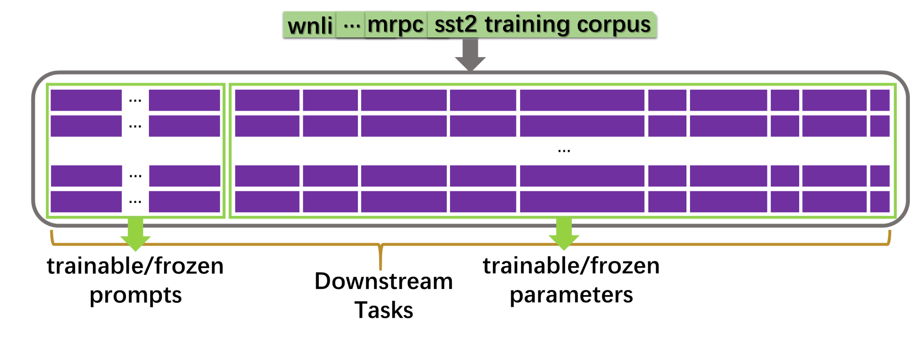
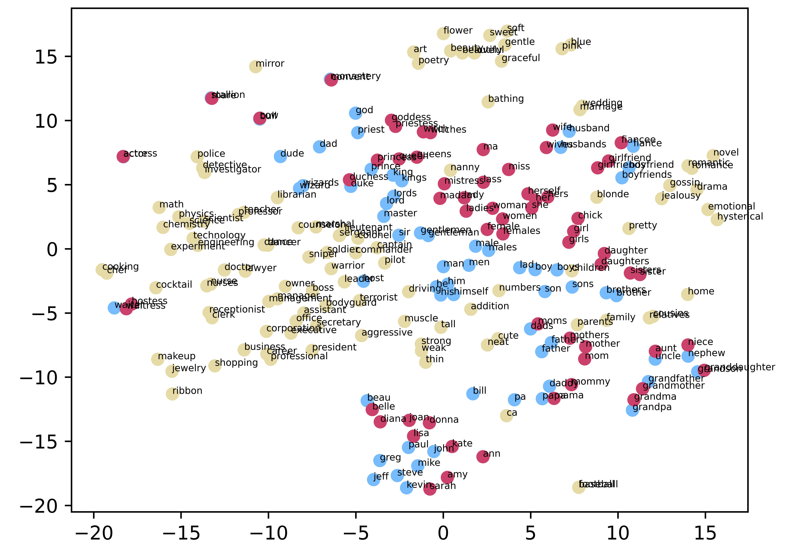
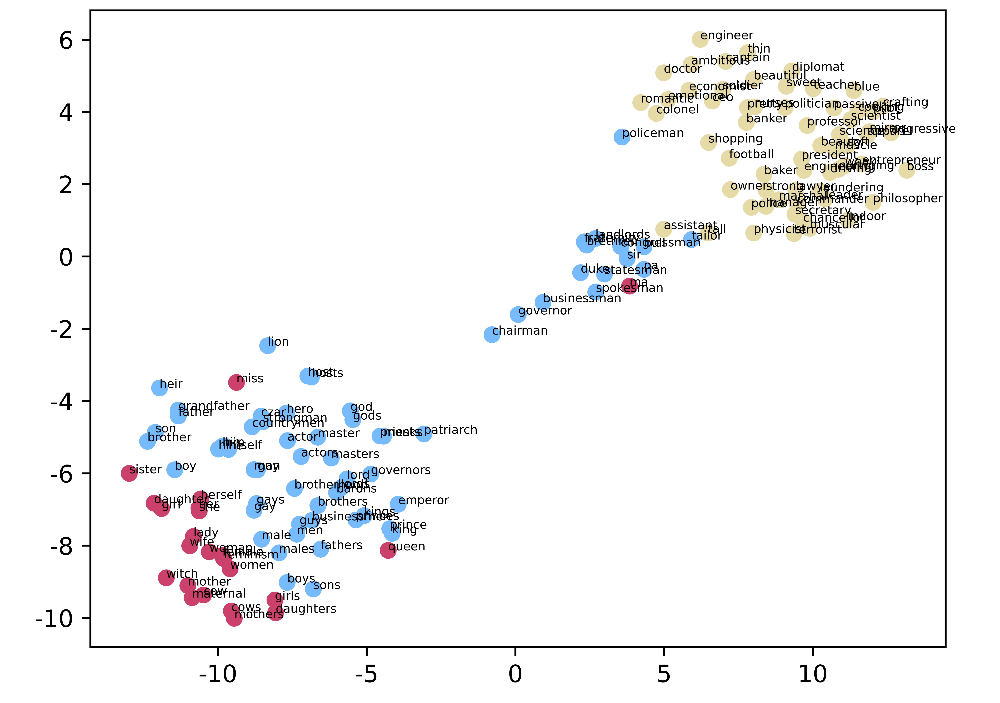
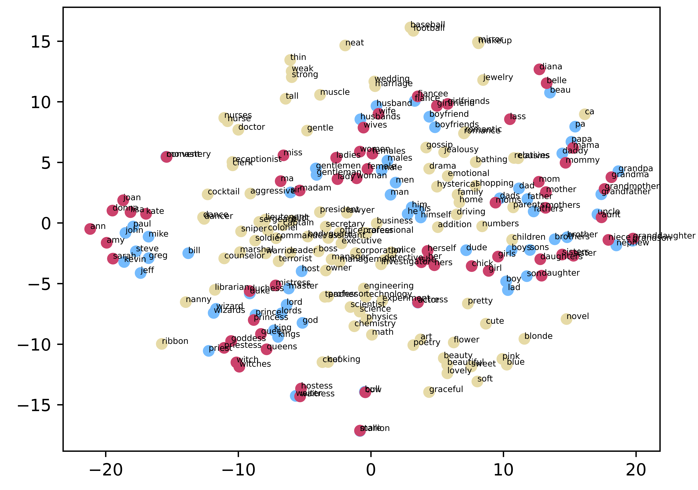
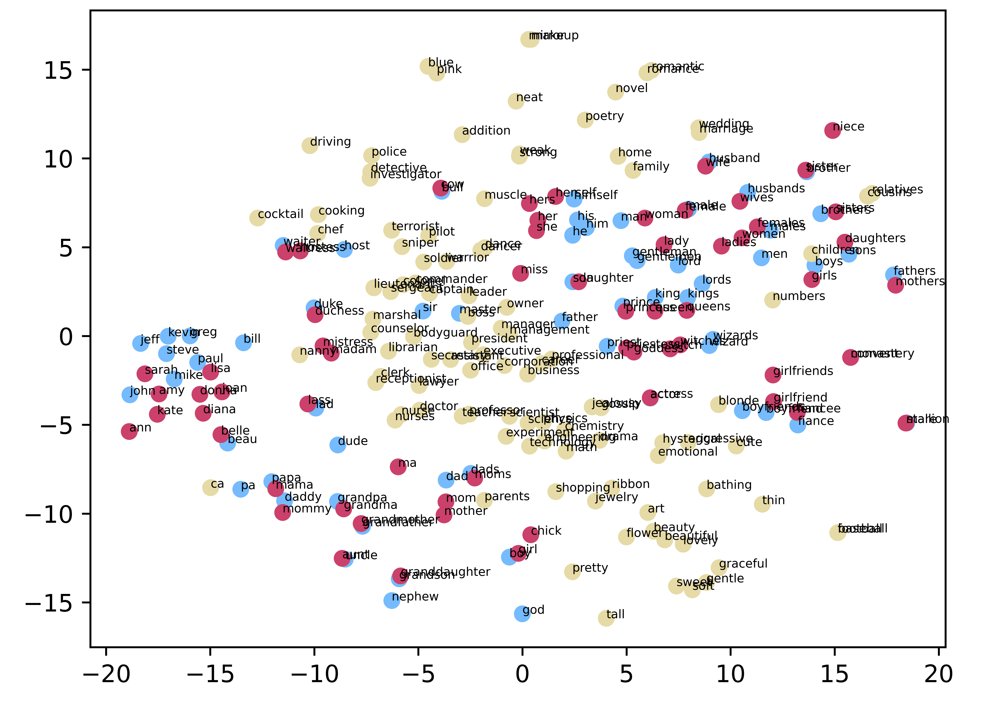
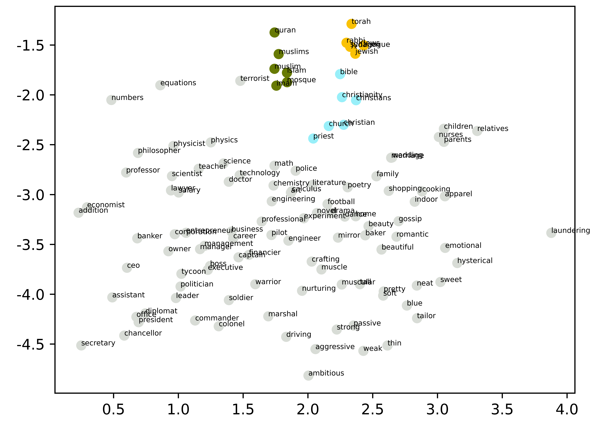
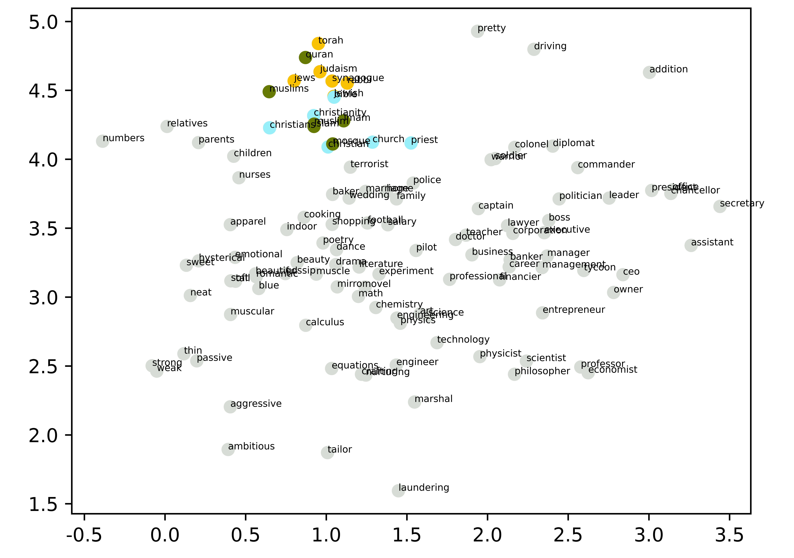

# ADEPT

Source code and data for *ADEPT: A DEbiasing PrompT Framework*.

An illustration of how debiasing works using **ADEPT** and for downstream tasks:


(a) While debiasing, **ADEPT** only trains the prompt parameters and keeps the base model frozen.



(b) When performing downstream tasks, **ADEPT** conditions the base model or both the prompt and the base model.

## Replication

We conduct experiments on the **bert-large-uncased** pretrained model from HuggingFace. By using **ADEPT**, we need only train 1.97M parameters when prompt-tuning with 40 prompt tokens, orders of magnitude smaller than the 335M parameters required for finetuning.

We provide bash scripts and codes to replicate our findings. Our environment is:

* Ubuntu servers with NVIDIA GeForce RTX 3090 (24G) GPUs
* cuda 11.1
* packages with certain versions

### Environment Setup

Create environment:

```bash
conda create -n debias python=3.8.5
conda activate debias
```

Install pytorch and python packages:

```bash
conda install -n pt2 pytorch==1.7.1 torchvision==0.8.2 torchaudio==0.7.2 cudatoolkit=11.0 -c pytorch
pip install -r requirements.txt
```

### Data

We've already included word lists for attributes in the data folder, so there is no need to acquire them from other resources. As for larger corpora, you can download News-Commentary v15 [here](https://data.statmt.org/news-commentary/v15/documents.tgz) and Hugging Face's BookCorpus replica [here](https://storage.googleapis.com/huggingface-nlp/datasets/bookcorpus/bookcorpus.tar.bz2). New-Commentary alone can support debiasing gender. You may need to create a new text file by combining the two corpora mentioned above so that there are sufficient sentences for debiasing religion. 

### Experiments

Collect sentences:

```bash
cd ADEPT/script
bash ./collect_sentences.sh bert [corpus_path] gender final
```

Debias:

```bash
bash ./debias.sh bert 0 ADEPT gender
```

Preprocess corpus for plotting word correlation (for better visualizating pairwise words' correlation, we highly suggest that you choose a large corpus, like a subset of bookcorpus sampled with function `sample_sentences_from_bookcorpus` in `utils.py`, because we have set sentence threshold for a word if it is to be plotted):

```bash
bash ./preprocess_plot_word_correlation.sh bert 0 gender [corpus_path]
```

Plot word correlation:

```bash
bash ./plot_word_correlation.sh bert 0 ADEPT gender [model_name_or_path]
```

### Visualization:

#### Gender Domin:



(a) **original**



(b) **DPCE**



(c) **ADEPT-finetuning**



(d) **ADEPT**

#### Religion Domin:



(a) **original**



(b) **ADEPT**